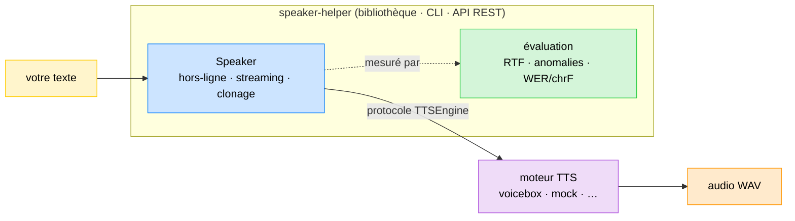

# Speaker Helper

[🇫🇷](LISEZMOI.md) · [🇬🇧](README.md)


`Speaker Helper` fait partie d'une collection de bibliothèques appelée `AI Helpers`, développée pour construire de l'Intelligence Artificielle.

[🌍 AI Helpers](https://harchaoui.org/warith/ai-helpers)

[](https://harchaoui.org/warith/ai-helpers)


**Synthèse vocale professionnelle — hors-ligne et en streaming, avec clonage de
voix et une passerelle d'évaluation intégrée — au-dessus d'un moteur TTS local
([Voicebox](https://github.com/jamiepine/voicebox) par défaut).**

speaker-helper est le pendant de
[`vocal-helper`](https://github.com/warith-harchaoui) : là où vocal-helper
transforme la *parole en texte*, speaker-helper transforme le **texte en
parole**. Il fournit une API Python typée, une CLI et une API REST — utilisable
en local (conda + pip) ou comme serveur Docker.

- **Deux modes.** *Hors-ligne* (tout le texte → un audio) et *streaming*
  (découpage en phrases, faible temps jusqu'au premier son).
- **Temps réel sur CPU.** Le moteur `kokoro` par défaut synthétise plus vite
  que le temps réel (RTF nettement inférieur à 1.0) — sans GPU.
- **Agnostique du moteur.** Le moteur est un détail d'implémentation derrière un
  protocole `TTSEngine`. Voicebox est le défaut ; un backend `mock` déterministe
  est fourni pour les tests et la CI, et ajouter un backend est un changement
  local et minime.
- **Clonage de voix, partout.** Pointez vers un enregistrement et speaker-helper
  clone la voix — dans la bibliothèque, la CLI et l'API REST. Les transcriptions
  manquantes sont produites automatiquement avec
  [`vocal-helper`](https://github.com/warith-harchaoui).
- **Évaluation IA intégrée.** Un jeu de données committé, des seuils versionnés
  et des métriques de vitesse/anomalie/fidélité verrouillent la qualité en CI —
  pas de « vibe checks ».
- **Tout inclus.** Bibliothèque, CLI, API REST, Docker.

Voir [`EXAMPLES.md`](EXAMPLES.md) pour un recueil d'exemples exécutables, et
[`README.md`](README.md) pour la version anglaise.

---

## Fonctionnement



speaker-helper ne parle qu'au protocole `TTSEngine`, donc le moteur concret
(Voicebox par défaut) est interchangeable. Lancez un moteur une fois, puis
pointez speaker-helper dessus.

---

## Installation

### 1. Dépendances système : libsndfile + ffmpeg

`soundfile` nécessite la bibliothèque native `libsndfile`, et `audio-helper`
(découpe/concaténation pour le clonage) utilise `ffmpeg`.

- macOS 🍎 : `brew install libsndfile ffmpeg`
  (installez `brew` grâce à [brew.sh](https://brew.sh/))
- Ubuntu 🐧 : `sudo apt install libsndfile1 ffmpeg`
- Windows 🪟 : `winget install ffmpeg` (`libsndfile` est inclus dans le wheel
  `soundfile` — rien à installer).

### 2. Le paquet (conda + pip, en local)

```bash
conda create -n speaker-helper python=3.11 -y
conda activate speaker-helper
pip install -e ".[server]"          # ajoutez ",dev" pour les outils de test/lint
pip install -e ".[server,stt]"      # ajoutez ",stt" pour auto-transcrire les références de clonage
```

speaker-helper fait partie de l'écosystème **AI Helpers** : il installe
automatiquement depuis git
[`os-helper`](https://github.com/warith-harchaoui/os-helper) (journalisation) et
[`audio-helper`](https://github.com/warith-harchaoui/audio-helper)
(découpe/concaténation audio). L'extra optionnel `stt` ajoute
[`vocal-helper`](https://github.com/warith-harchaoui/vocal-helper) pour
transcrire les références de clonage et l'aller-retour d'évaluation.

### 3. Un moteur Voicebox

```bash
git clone https://github.com/jamiepine/voicebox && cd voicebox
docker compose up --build            # écoute sur 127.0.0.1:17600
```

Indiquez ensuite à speaker-helper où il se trouve (`--port`, `settings.yaml`,
ou `SPEAKER_HELPER_VOICEBOX_PORT`).

---

## Prise en main rapide

### Python

```python
from speaker_helper import Speaker, Settings

spk = Speaker(Settings.from_mapping({
    "engine": "kokoro", "language": "fr", "voicebox": {"port": 17600},
}))
result = spk.save("Bonjour le monde.", "hello.wav")
print(f"{result.duration_s:.2f}s d'audio, RTF {result.rtf:.2f}")
# 2.80s d'audio, RTF 0.43
```

### CLI

```bash
speaker-helper --port 17600 voices --engine kokoro
speaker-helper --port 17600 synth "Bonjour le monde." -o hello.wav
speaker-helper --port 17600 synth "Une. Deux. Trois." -o out.wav --stream
speaker-helper --backend mock eval               # verrouille la qualité (sans moteur)
speaker-helper --port 17600 --clone synth "Bonjour." -o cloned.wav
```

### Serveur API REST

```bash
speaker-helper --port 17600 serve --host 0.0.0.0 --port 8080
curl -s -X POST localhost:8080/synth -H 'content-type: application/json' \
     -d '{"text": "Bonjour."}' -o out.wav
# streaming (Server-Sent Events, un chunk JSON par phrase) :
curl -N -X POST localhost:8080/synth/stream -H 'content-type: application/json' \
     -d '{"text": "Une. Deux. Trois."}'
```

Le serveur monte aussi un endpoint **Model Context Protocol** à `/mcp` (via
[`fastapi-mcp`](https://github.com/tadata-org/fastapi-mcp), inclus dans l'extra
`server`), qui expose `synth`, `synth_stream`, `clone_voice`, `list_voices` et
`health` comme outils MCP qu'un assistant peut appeler directement.

Ou avec Docker (le serveur pointe vers un Voicebox sur l'hôte) :

```bash
docker compose up --build            # API speaker-helper sur :8080
```

---

## Clonage de voix

Pointez vers un enregistrement et speaker-helper clone la voix — dans la
bibliothèque, la CLI et l'API REST. Si vous ne fournissez pas de transcription
de la référence, elle est produite automatiquement avec
[`vocal-helper`](https://github.com/warith-harchaoui) (installez l'extra `stt`).
Une référence prête à l'emploi (`assets/ref-malo.wav`) sert de défaut.

```python
from speaker_helper import Speaker, Settings, VoiceSample

spk = Speaker(Settings.from_mapping({"engine": "chatterbox", "voicebox": {"port": 17600}}))
# ne donnez que l'audio — la transcription est produite et alignée pour vous :
await spk.clone_voice("malo", [VoiceSample("ma_voix.wav", "")])
result = await spk.say("Maintenant je parle avec la voix clonée.")
```

```bash
speaker-helper --port 17600 clone                        # clone le ref-malo fourni, affiche l'id
speaker-helper --port 17600 --clone-audio ma_voix.wav synth "Bonjour." -o out.wav
```

Un audio de référence plus long que la limite du moteur (Voicebox : 30 s) est
automatiquement tronqué (via
[`audio-helper`](https://github.com/warith-harchaoui/audio-helper)) et
re-transcrit pour que l'audio et le texte restent alignés.

---

## Évaluation (pas de « vibe checks »)

La qualité est verrouillée, pas devinée. `speaker-helper eval` exécute le moteur
sur un jeu de données committé et vérifie des seuils versionnés — **synthèse plus
rapide que le temps réel**, **zéro anomalie audio** (vide / saturé / durée
aberrante) et, avec un transcripteur branché, un **aller-retour** WER/chrF. Il
sort avec un code non nul quand la barre n'est pas atteinte, ce qui verrouille la
CI.

```bash
speaker-helper --backend mock eval                 # déterministe, sans moteur
speaker-helper --port 17600 --engine kokoro eval --json report.json
# backend=voicebox engine=kokoro cases=12
# mean_rtf=0.3534 p95_rtf=0.3989 anomaly_rate=0.0 quality=0.75 (prior)
# PASS
```

L'évaluation cible le `Speaker` agnostique du moteur, donc la même passerelle
évalue le backend `mock` en CI ou un vrai moteur en local — seul `--backend`
change.

---

## Configuration

Copiez [`settings.yaml.example`](settings.yaml.example) vers `settings.yaml`
(ignoré par git). Chaque clé peut être surchargée par une variable
d'environnement `SPEAKER_HELPER_*` ; les références `${VAR}` dans le YAML sont
remplacées depuis l'environnement au chargement.

---

## Développement

```bash
pip install -e ".[dev,server]"
pytest -q -m "not slow"       # suite rapide et déterministe (sans moteur)
pytest -q                     # inclut les tests live @slow (nécessite Voicebox)
ruff check speaker_helper tests
speaker-helper --backend mock eval    # exécute la passerelle d'évaluation en local
```

La CI exécute ruff + la suite rapide sur Python 3.10–3.13 ; un test qui échoue
bloque les fusions. La suite rapide pilote le backend `mock` déterministe, elle
ne nécessite donc aucun moteur.

---

## Remerciements

Remerciements chaleureux aux contributrices, contributeurs, relectrices,
relecteurs et utilisateurs qui ont aidé à améliorer ce projet — ainsi qu'aux
auteurs de [Voicebox](https://github.com/jamiepine/voicebox), le moteur sur
lequel speaker-helper s'appuie.

## Licence

BSD-3-Clause © Warith HARCHAOUI.
