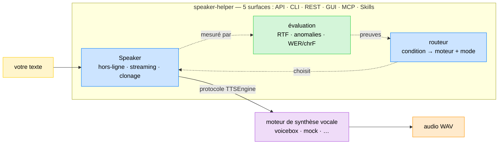

# Speaker Helper

[🇫🇷](LISEZMOI.md) · [🇬🇧](README.md)

[](https://github.com/warith-harchaoui/speaker-helper/actions/workflows/ci.yml) [](LICENSE) [](#)

`Speaker Helper` fait partie d'une collection de bibliothèques appelée `AI Helpers`, développée pour construire de l'Intelligence Artificielle.

[🌍 AI Helpers](https://harchaoui.org/warith/ai-helpers)

[](https://harchaoui.org/warith/ai-helpers)


**Synthèse vocale professionnelle — hors-ligne et en streaming, avec clonage de
voix et une passerelle d'évaluation intégrée — au-dessus d'un moteur de synthèse vocale local
([Voicebox](https://github.com/jamiepine/voicebox) par défaut).**

speaker-helper est le pendant de
[`vocal-helper`](https://github.com/warith-harchaoui) : là où vocal-helper
transforme la *parole en texte*, speaker-helper transforme le **texte en
parole**. Il vous donne le même cœur au travers de **cinq surfaces** — une API
Python typée, une CLI, une API REST, une GUI web minimale, un serveur MCP et des
skills Claude/OpenCode — utilisable en local (conda + pip) ou comme serveur
Docker.

- **Deux modes.** *Hors-ligne* (tout le texte → un audio) et *streaming*
  (découpage en phrases, faible temps jusqu'au premier son).
- **Aiguillage automatique du moteur.** Indiquez à speaker-helper votre
  *condition* — **temps réel en ligne** (streaming à délai borné ; la vitesse =
  facteur temps réel, doit tourner plus vite que le temps réel) ou **hors-ligne**
  (par lots ; la qualité est le seul objectif) — et le routeur choisit le
  meilleur moteur + mode à partir de preuves qualité↔vitesse mesurées, avec une
  justification qui cite les chiffres. Sans deviner.
- **Temps réel sur CPU.** Le moteur `kokoro` par défaut synthétise plus vite
  que le temps réel (RTF nettement inférieur à 1.0) — sans GPU.
- **Agnostique du moteur.** Le moteur est un détail d'implémentation derrière un
  protocole `TTSEngine`. Voicebox est le défaut ; un backend `mock` déterministe
  est fourni pour les tests et la CI, et ajouter un backend est un changement
  local et minime.
- **Clonage de voix, partout.** Pointez vers un enregistrement et speaker-helper
  clone la voix — dans la bibliothèque, la CLI, l'API REST et la GUI. Les
  transcriptions manquantes sont produites automatiquement avec
  [`vocal-helper`](https://github.com/warith-harchaoui).
- **Évaluation IA intégrée.** Un jeu de données committé, des seuils versionnés
  et des métriques de vitesse/anomalie/fidélité verrouillent la qualité en CI —
  pas de « vibe checks ». La qualité est mesurée comme l'**intelligibilité** en
  aller-retour (texte→parole→texte WER/chrF).
- **Auto-hébergé, sans Hugging Face à l'exécution.** Un bundle optionnel
  [`speaker-engines`](#moteurs-auto-hébergés-sans-hugging-face) sert chaque
  moteur + modèle de métrique depuis votre propre serveur, si bien que les
  moteurs tournent en environnement clos.
- **Tout inclus.** Bibliothèque, CLI (argparse + click), API REST, GUI web,
  serveur MCP, skills Claude/OpenCode, Docker.

Voir [`EXAMPLES.md`](EXAMPLES.md) pour un recueil d'exemples exécutables,
[`docs/tech-report.fr.md`](docs/tech-report.fr.md) pour le rapport technique
([EN](docs/tech-report.en.md)),
et [`README.md`](README.md) pour la version
anglaise.

## Documentation

[💻 Documentation](https://harchaoui.org/warith/ai-helpers/docs/speaker-helper-doc/)

[🗺️ Paysage](https://github.com/warith-harchaoui/speaker-helper/blob/main/PAYSAGE.md)

[📋 Exemples](https://github.com/warith-harchaoui/speaker-helper/blob/main/EXAMPLES.md)

## Fonctionnement



speaker-helper ne parle qu'au protocole `TTSEngine`, donc le moteur concret
(Voicebox par défaut) est interchangeable. Le **routeur** transforme une
condition de fonctionnement en un moteur + mode concrets à partir de preuves
mesurées ; la couche d'**évaluation** produit ces preuves. Lancez un moteur une
fois, puis pointez speaker-helper dessus.

---

## Installation

**Prérequis** — **Python 3.10–3.13** et **git**, **libsndfile**, **ffmpeg**, multiplateforme. `soundfile` nécessite la bibliothèque native `libsndfile`, et `audio-helper` (découpe/concaténation pour le clonage) utilise `ffmpeg` :

- 🍎 **macOS** ([Homebrew](https://brew.sh)) : `brew install python git libsndfile ffmpeg`
- 🐧 **Ubuntu/Debian** : `sudo apt update && sudo apt install -y python3 python3-pip git libsndfile1 ffmpeg`
- 🪟 **Windows** (PowerShell) : `winget install Python.Python.3.12 Git.Git ffmpeg` (`libsndfile` est inclus dans le wheel `soundfile` — rien à installer).

Nous recommandons d'utiliser des environnements Python. Consultez ce lien si vous ne savez pas en configurer un : [🥸 Tech tips](https://harchaoui.org/warith/4ml/#install).

### Depuis les sources

speaker-helper n'est **pas encore sur PyPI** (release PyPI à venir). Comme les
autres projets `*-helper`, il s'installe depuis git, épinglé sur un tag de
release :

```bash
# cœur
pip install "git+https://github.com/warith-harchaoui/speaker-helper.git@v0.7.5"
# avec extras (serveur + MCP, et STT pour clonage/aller-retour d'éval) :
pip install "speaker-helper[server,stt] @ git+https://github.com/warith-harchaoui/speaker-helper.git@v0.7.5"
```

Extras disponibles : `server` (API REST + MCP), `stt` (vocal-helper), `youtube`,
`podcast`, `mic` (sources speech-to-speech), `eval` (DeepEval), `dev`.

Ou, pour le développement local (conda + pip) :

```bash
conda create -n speaker-helper python=3.11 -y
conda activate speaker-helper
pip install -e ".[server]"          # ajoutez ",dev" pour les outils de test/lint
pip install -e ".[server,stt]"      # ajoutez ",stt" pour auto-transcrire les références de clonage
```

speaker-helper fait partie de l'écosystème **AI Helpers** : il installe
automatiquement [`os-helper`](https://github.com/warith-harchaoui/os-helper)
(journalisation) et
[`audio-helper`](https://github.com/warith-harchaoui/audio-helper)
(découpe/concaténation audio). L'extra optionnel `stt` ajoute
[`vocal-helper`](https://github.com/warith-harchaoui/vocal-helper) pour
transcrire les références de clonage et l'aller-retour d'évaluation.

### Un moteur Voicebox

speaker-helper a besoin d'un Voicebox en fonctionnement.

- **Apple Silicon (recommandé) : Voicebox natif MLX sur `:17493`.** Il utilise
  le **GPU** Apple et est nettement plus rapide (bien sous le temps réel). C'est
  le port par défaut de speaker-helper — aucun override nécessaire. Note :
  Docker sur macOS n'a **pas de passthrough GPU/Metal**, seul le build natif
  bénéficie du GPU.
- **CPU / Docker sur `:17600`** (portable, sans GPU) : bien pour la
  fonctionnalité ; le facteur temps réel est à la limite et sensible à la charge
  sur CPU (voir [`BENCHMARKS.md`](BENCHMARKS.md)).

```bash
git clone https://github.com/jamiepine/voicebox && cd voicebox
docker compose up --build            # écoute sur 127.0.0.1:17600
```

Indiquez ensuite à speaker-helper où il se trouve (`--port`, `settings.yaml`,
ou `SPEAKER_HELPER_VOICEBOX_PORT`).

### Moteurs auto-hébergés (sans Hugging Face)

Par défaut, le serveur de moteurs télécharge les poids des modèles depuis
Hugging Face à la première utilisation. Pour une machine de production ou en
environnement clos, vous pouvez à la place servir chaque moteur — **et les
modèles « métriques » de l'évaluation** — depuis des archives auto-hébergées, si
bien que rien n'est récupéré depuis Hugging Face à l'exécution. Le bundle est
livré en **plusieurs petits zips** (un par moteur TTS + un pour les modèles de
métriques) : vous ne téléchargez que ce que vous utilisez, et chaque zip se
décompresse dans la même arborescence `speaker-engines/` :

```bash
cd "$HOME"
for z in tts-hexgrad-kokoro-82m metrics; do                 # ajoutez les moteurs voulus
  curl -L "https://harchaoui.org/warith/speaker-engines/speaker-engines-${z}.zip" -o "se-${z}.zip"
  unzip -oq "se-${z}.zip"                                    # -> ~/speaker-engines/…
done
export VOICEBOX_MODELS_DIR="$HOME/speaker-engines/tts"       # Voicebox lit ceci
export HF_HUB_OFFLINE=1                                      # ne contacte jamais l'extérieur
# démarrez le moteur comme d'habitude — il charge maintenant kokoro/chatterbox/… depuis le bundle
```

Les zips se construisent une fois avec les scripts de `~/speaker-engines/` (voir
son `README.md`) ; côté exécution, seules les deux variables d'environnement
ci-dessus sont nécessaires.

---

## Prise en main rapide

### Python

```python
from speaker_helper import Speaker, Settings

spk = Speaker(Settings.from_mapping({
    "engine": "kokoro", "language": "fr", "voicebox": {"port": 17600},
}))
result = spk.save("Bonjour le monde.", "hello.wav")
print(f"{result.duration_s:.2f}s d'audio, RTF {result.rtf:.2f}")
# 2.80s d'audio, RTF 0.43
```

### CLI

La commande principale `speaker-helper` est un groupe
[click](https://click.palletsprojects.com) ; le front-end argparse de la
bibliothèque standard reste disponible sous `speaker-helper-argparse` (mêmes
sous-commandes). Les options globales précèdent la sous-commande
(`speaker-helper --backend mock synth …`).

```bash
speaker-helper --port 17600 voices --engine kokoro
speaker-helper --port 17600 synth "Bonjour le monde." -o hello.wav
speaker-helper --port 17600 synth "Une. Deux. Trois." -o out.wav --stream
speaker-helper route --condition online_realtime --language fr    # choisit un moteur
speaker-helper --backend mock eval               # verrouille la qualité (sans moteur)
speaker-helper --port 17600 --clone synth "Bonjour." -o cloned.wav
```

### Serveur API REST

```bash
speaker-helper --port 17600 serve --host 0.0.0.0 --port 8080
curl -s -X POST localhost:8080/synth -H 'content-type: application/json' \
     -d '{"text": "Bonjour."}' -o out.wav
# streaming (Server-Sent Events, un chunk JSON par phrase) :
curl -N -X POST localhost:8080/synth/stream -H 'content-type: application/json' \
     -d '{"text": "Une. Deux. Trois."}'
```

Le serveur, en plus :

- sert une **GUI web minimale** à `/` (une page vanilla-JS + Tailwind sans
  dépendance pour la synthèse, le streaming, les voix, le clonage et le
  routeur) — ouvrez simplement `http://localhost:8080/` ;
- expose `POST /route` (le routeur de moteurs) aux côtés de `/synth`,
  `/synth/stream`, `/voices` et `/clone` ;
- monte un endpoint **Model Context Protocol** à `/mcp` (via
  [`fastapi-mcp`](https://github.com/tadata-org/fastapi-mcp), inclus dans l'extra
  `server`), qui expose `synth`, `synth_stream`, `clone_voice`, `list_voices`,
  `route` et `health` comme outils MCP qu'un assistant peut appeler directement.

Ou avec Docker (le serveur pointe vers un Voicebox sur l'hôte) :

```bash
docker compose up --build            # API speaker-helper sur :8080
```

---

## Choisir un moteur (le routeur)

La couche d'évaluation *mesure* la qualité et la vitesse ; le **routeur** agit
sur ces preuves. Vous énoncez une **condition** de fonctionnement et il renvoie
un moteur + mode concrets, justifiés par les chiffres — jamais une supposition.

- **`online_realtime`** — streaming à délai borné. La vitesse est le **facteur
  temps réel (RTF)** : le moteur doit synthétiser *plus vite que le temps réel*
  (`RTF < 1`), avec une marge pour le temps jusqu'au premier son et la gigue
  (plafond `0.8`). Parmi les moteurs qui tiennent le rythme, le routeur
  **maximise la qualité** sur le front de Pareto qualité↔RTF, et sélectionne le
  streaming avec des réglages à faible TTFA.
- **`offline`** — par lots. Il n'y a aucune contrainte temps réel, donc **la
  qualité est le seul objectif** : le moteur de plus haute qualité l'emporte, la
  vitesse est ignorée.

La qualité est mesurée comme l'**intelligibilité** en aller-retour
(texte→parole→texte WER/chrF via `vocal-helper`) ou, tant qu'un moteur n'est pas
mesuré, un prior hérité — chaque décision indique lequel (`quality_source`) et un
flag de `confidence`.

```python
from speaker_helper import route, RouteRequest, Speaker

decision = route(RouteRequest(condition="online_realtime", language="fr"))
print(decision.engine, decision.mode, decision.confidence)
print(decision.justification)

# ou construisez un Speaker directement depuis un point de fonctionnement routé :
spk = Speaker.from_route("offline", language="fr")
```

```bash
speaker-helper route --condition online_realtime --language fr
speaker-helper route --condition offline --json decision.json
```

Les nouveaux moteurs sont caractérisés dans l'*étude* compagne (RTF / MOS /
similarité de locuteur mesurés) et réinjectés ici comme données — la boîte à
outils aiguille, l'étude mesure.

---

## Clonage de voix

Pointez vers un enregistrement et speaker-helper clone la voix — dans la
bibliothèque, la CLI et l'API REST. Si vous ne fournissez pas de transcription
de la référence, elle est produite automatiquement avec
[`vocal-helper`](https://github.com/warith-harchaoui) (installez l'extra `stt`).
Une référence prête à l'emploi (`assets/ref-malo.wav`) sert de défaut.

```python
from speaker_helper import Speaker, Settings, VoiceSample

spk = Speaker(Settings.from_mapping({"engine": "chatterbox", "voicebox": {"port": 17600}}))
# ne donnez que l'audio — la transcription est produite et alignée pour vous :
await spk.clone_voice("malo", [VoiceSample("ma_voix.wav", "")])
result = await spk.say("Maintenant je parle avec la voix clonée.")
```

```bash
speaker-helper --port 17600 clone                        # clone le ref-malo fourni, affiche l'id
speaker-helper --port 17600 --clone-audio ma_voix.wav synth "Bonjour." -o out.wav
```

Un audio de référence plus long que la limite du moteur (Voicebox : 30 s) est
automatiquement tronqué (via
[`audio-helper`](https://github.com/warith-harchaoui/audio-helper)) et
re-transcrit pour que l'audio et le texte restent alignés.

---

## Speech-to-speech (re-voicing)

Importez de l'audio depuis les paquets sources de l'écosystème AI Helpers et
re-voicez-le — transcrit avec
[`vocal-helper`](https://github.com/warith-harchaoui) puis re-synthétisé
(éventuellement dans une voix clonée ou une autre langue) :

```python
import asyncio
from speaker_helper import Speaker, Settings
from speaker_helper.sources import from_youtube, revoice

async def main() -> None:
    src = from_youtube("https://youtu.be/…")                 # extra : youtube
    async with Speaker(Settings.from_mapping({"voicebox": {"port": 17600}})) as spk:
        out = await revoice(src, spk)                        # transcrit + re-parle
    open("revoiced.wav", "wb").write(out.wav_bytes)

asyncio.run(main())
```

```bash
speaker-helper --port 17600 speak-from --source youtube --url https://youtu.be/… -o out.wav
speaker-helper --port 17600 speak-from --source podcast --url https://feed/rss   -o out.wav
speaker-helper --port 17600 --clone speak-from --source mic --seconds 5          -o out.wav
```

Les sources sont des extras optionnels : `youtube` (`youtube-helper`), `podcast`
(`podcast-helper`), `mic` (`capture-helper`).

---

## Évaluation (pas de « vibe checks »)

La qualité est verrouillée, pas devinée. `speaker-helper eval` exécute le moteur
sur un jeu de données committé et vérifie des seuils versionnés — **synthèse plus
rapide que le temps réel**, **zéro anomalie audio** (vide / saturé / durée
aberrante) et, avec un transcripteur branché, un **aller-retour** WER/chrF. Il
sort avec un code non nul quand la barre n'est pas atteinte, ce qui verrouille la
CI.

```bash
speaker-helper --backend mock eval                 # déterministe, sans moteur
speaker-helper --port 17600 --engine kokoro eval --json report.json
# backend=voicebox engine=kokoro cases=12
# mean_rtf=0.3534 p95_rtf=0.3989 anomaly_rate=0.0 quality=0.75 (prior)
# PASS
```

L'évaluation cible le `Speaker` agnostique du moteur, donc la même passerelle
évalue le backend `mock` en CI ou un vrai moteur en local — seul `--backend`
change.

Pour les équipes qui standardisent sur un framework, l'extra `eval` ajoute un
pont [DeepEval](https://github.com/confident-ai/deepeval)
(`RealTimeFactorMetric`, `AudioIntegrityMetric` et `RoundTripIdempotenceMetric`
— le contrôle chrF texte→parole→texte) qui rapporte les mêmes mesures comme
métriques DeepEval — déterministe et hors-ligne.

---

## Configuration

Copiez [`settings.yaml.example`](settings.yaml.example) vers `settings.yaml`
(ignoré par git) ou utilisez
[`speaker_config.json.example`](speaker_config.json.example) comme référence.
Chaque clé peut être surchargée par une variable d'environnement
`SPEAKER_HELPER_*` ; les références `${VAR}` dans le YAML sont remplacées depuis
l'environnement au chargement.

---

## Skills Claude / OpenCode

Le répertoire `skills/` contient des [skills Claude /
OpenCode](https://docs.claude.com/en/docs/agents-and-tools/agent-skills)
portables, si bien qu'un assistant peut piloter speaker-helper directement :

- `speaker-helper-synthesize` — texte → parole (hors-ligne + streaming), voix ;
- `speaker-helper-clone-voice` — clone une voix depuis un enregistrement de
  référence ;
- `speaker-helper-choose-engine` — le routeur (choisir un moteur par condition
  et qualité↔vitesse).

Copiez un dossier de skill dans `~/.claude/skills/` (ou le
`.claude/skills/` de votre projet, ou le répertoire de skills d'OpenCode) —
aucune modification nécessaire ; le format est partagé.

---

## Développement

```bash
pip install -e ".[dev,server]"
pytest -q -m "not slow"       # suite rapide et déterministe (sans moteur)
pytest -q --cov=speaker_helper --cov-report=term-missing   # avec couverture
pytest -q                     # inclut les tests live @slow (nécessite Voicebox)
ruff check speaker_helper tests && ruff format --check speaker_helper tests
speaker-helper --backend mock eval    # exécute la passerelle d'évaluation en local
```

La CI exécute ruff (lint + format) et la suite rapide avec couverture verrouillée
(`--cov-fail-under=70`) sur Python 3.10–3.13 ; un test qui échoue bloque les
fusions. La suite rapide pilote le backend `mock` déterministe, elle ne nécessite
donc aucun moteur.

---

## Auteur

- [Warith HARCHAOUI](https://linkedin.com/in/warith-harchaoui)

## Remerciements

Remerciements chaleureux aux contributrices, contributeurs, relectrices,
relecteurs et utilisateurs qui ont aidé à améliorer ce projet — ainsi qu'aux
auteurs de [Voicebox](https://github.com/jamiepine/voicebox), le moteur sur
lequel speaker-helper s'appuie.

## Licence

BSD-3-Clause © Warith HARCHAOUI.
