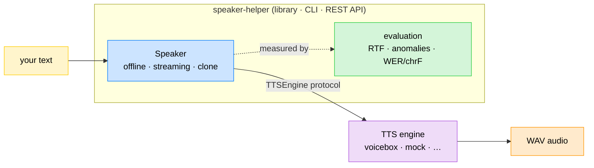

# Speaker Helper

[🇫🇷](LISEZMOI.md) · [🇬🇧](README.md)


`Speaker Helper` belongs to a collection of libraries called `AI Helpers` developed for building Artificial Intelligence.

[🌍 AI Helpers](https://harchaoui.org/warith/ai-helpers)

[](https://harchaoui.org/warith/ai-helpers)


**Professional text-to-speech — offline and streaming, with voice cloning and a
built-in evaluation gate — over a local TTS engine
([Voicebox](https://github.com/jamiepine/voicebox) by default).**

speaker-helper is the counterpart of
[`vocal-helper`](https://github.com/warith-harchaoui): where vocal-helper turns
*speech into text*, speaker-helper turns **text into speech**. It gives you a
small, typed Python API, a CLI, and a REST API — runnable locally (conda + pip)
or as a Docker server.

- **Two modes.** *Offline* (whole text → one audio) and *streaming*
  (sentence-split, low time-to-first-audio).
- **Real-time on CPU.** The default `kokoro` engine synthesises faster than
  real time (real-time factor well below 1.0) — no GPU required.
- **Backend-agnostic.** The engine is an implementation detail behind a
  `TTSEngine` protocol. Voicebox is the default; a deterministic `mock` backend
  ships for tests and CI, and new backends are a small, local change.
- **Voice cloning, everywhere.** Point at a recording and speaker-helper clones
  the voice — in the library, CLI, and REST API. Missing transcripts are
  derived automatically with [`vocal-helper`](https://github.com/warith-harchaoui).
- **Built-in AI evaluation.** A committed dataset, versioned thresholds, and
  speed/anomaly/fidelity metrics gate quality in CI — no vibe checks.
- **Batteries included.** Library, CLI, REST API, Docker.

See [`EXAMPLES.md`](EXAMPLES.md) for a runnable cookbook, and
[`LISEZMOI.md`](LISEZMOI.md) for the French version.

---

## How it fits together



speaker-helper talks only to the `TTSEngine` protocol, so the concrete engine
(Voicebox by default) is swappable. Start an engine once, then point
speaker-helper at it.

---

## Install

### 1. System dependencies: libsndfile + ffmpeg

`soundfile` needs the native `libsndfile` library, and `audio-helper` (voice-clone
trimming / concatenation) uses `ffmpeg`.

- macOS 🍎 : `brew install libsndfile ffmpeg`
  (install `brew` thanks to [brew.sh](https://brew.sh/))
- Ubuntu 🐧 : `sudo apt install libsndfile1 ffmpeg`
- Windows 🪟 : `winget install ffmpeg` (`libsndfile` is bundled with the
  `soundfile` wheel — no separate install).

### 2. The package (conda + pip, local)

```bash
conda create -n speaker-helper python=3.11 -y
conda activate speaker-helper
pip install -e ".[server]"          # add ",dev" for the test/lint toolchain
pip install -e ".[server,stt]"      # add ",stt" to auto-transcribe clone references
```

speaker-helper is part of the **AI Helpers** ecosystem: it installs
[`os-helper`](https://github.com/warith-harchaoui/os-helper) (logging) and
[`audio-helper`](https://github.com/warith-harchaoui/audio-helper) (audio
slicing/concatenation) from git automatically. The optional `stt` extra adds
[`vocal-helper`](https://github.com/warith-harchaoui/vocal-helper) for
transcribing voice-clone references and the evaluation round-trip.

### 3. A Voicebox engine

speaker-helper needs a running Voicebox. Either run Voicebox natively (MLX,
fastest on Apple Silicon — see the Voicebox repo) on its default port `17493`,
or with Docker on host port `17600`:

```bash
git clone https://github.com/jamiepine/voicebox && cd voicebox
docker compose up --build            # serves on 127.0.0.1:17600
```

Then tell speaker-helper where it is (`--port`, `settings.yaml`, or
`SPEAKER_HELPER_VOICEBOX_PORT`).

---

## Quickstart

### Python

```python
from speaker_helper import Speaker, Settings

spk = Speaker(Settings.from_mapping({
    "engine": "kokoro", "language": "fr", "voicebox": {"port": 17600},
}))
result = spk.save("Bonjour le monde.", "hello.wav")
print(f"{result.duration_s:.2f}s audio, RTF {result.rtf:.2f}")
# 2.80s audio, RTF 0.43
```

### CLI

```bash
speaker-helper --port 17600 voices --engine kokoro
speaker-helper --port 17600 synth "Bonjour le monde." -o hello.wav
speaker-helper --port 17600 synth "Une. Deux. Trois." -o out.wav --stream
speaker-helper --backend mock eval               # gate quality (no engine needed)
speaker-helper --port 17600 --clone synth "Bonjour." -o cloned.wav
```

### REST API server

```bash
speaker-helper --port 17600 serve --host 0.0.0.0 --port 8080
curl -s -X POST localhost:8080/synth -H 'content-type: application/json' \
     -d '{"text": "Bonjour."}' -o out.wav
# streaming (Server-Sent Events, one JSON chunk per sentence):
curl -N -X POST localhost:8080/synth/stream -H 'content-type: application/json' \
     -d '{"text": "Une. Deux. Trois."}'
```

Or with Docker (server points at a Voicebox on the host):

```bash
docker compose up --build            # speaker-helper API on :8080
```

---

## Voice cloning

Point at a recording and speaker-helper clones the voice — in the library, CLI,
and REST API. If you do not supply a transcript of the reference, it is derived
automatically with [`vocal-helper`](https://github.com/warith-harchaoui) (install
the `stt` extra). A ready-to-use reference (`assets/ref-malo.wav`) ships as the
default.

```python
from speaker_helper import Speaker, Settings, VoiceSample

spk = Speaker(Settings.from_mapping({"engine": "chatterbox", "voicebox": {"port": 17600}}))
# give only the audio — the transcript is transcribed and aligned for you:
await spk.clone_voice("malo", [VoiceSample("my_voice.wav", "")])
result = await spk.say("Maintenant je parle avec la voix clonée.")
```

```bash
speaker-helper --port 17600 clone                       # clone the bundled ref-malo, print id
speaker-helper --port 17600 --clone-audio my_voice.wav synth "Bonjour." -o out.wav
```

Reference audio longer than the engine's limit (Voicebox: 30 s) is trimmed
automatically (via [`audio-helper`](https://github.com/warith-harchaoui)) and
re-transcribed so audio and text stay aligned.

---

## Evaluation (no vibe checks)

Quality is gated, not guessed. `speaker-helper eval` runs the engine over a
committed dataset and checks versioned thresholds — **synthesis faster than real
time**, **zero audio anomalies** (empty / clipped / aberrant duration), and,
with an STT transcriber wired in, a WER/chrF **round-trip**. It exits non-zero
when the bar is missed, so it gates CI.

```bash
speaker-helper --backend mock eval                 # deterministic, no engine
speaker-helper --port 17600 --engine kokoro eval --json report.json
# backend=voicebox engine=kokoro cases=12
# mean_rtf=0.3534 p95_rtf=0.3989 anomaly_rate=0.0 quality=0.75 (prior)
# PASS
```

The evaluation targets the engine-agnostic `Speaker`, so the same gate grades
the `mock` backend in CI or a real engine locally — only `--backend` differs.

---

## Configuration

Copy [`settings.yaml.example`](settings.yaml.example) to `settings.yaml` (it is
gitignored) or use [`speaker_config.json.example`](speaker_config.json.example)
as a reference. Every key can be overridden by a `SPEAKER_HELPER_*` environment
variable; `${VAR}` references inside the YAML are expanded from the environment.

---

## Development

```bash
pip install -e ".[dev,server]"
pytest -q -m "not slow"       # fast, deterministic suite (no engine needed)
pytest -q                     # also runs @slow live tests (needs Voicebox)
ruff check speaker_helper tests
speaker-helper --backend mock eval    # run the evaluation gate locally
```

CI runs ruff + the fast suite on Python 3.10–3.13; a failing test blocks merges.
The fast suite drives the deterministic `mock` backend, so it needs no engine.

---

## Acknowledgements

Special thanks to the contributors, reviewers, and users who helped improve
this project — and to the [Voicebox](https://github.com/jamiepine/voicebox)
authors for the engine speaker-helper builds on.

## License

BSD-3-Clause © Warith HARCHAOUI.
