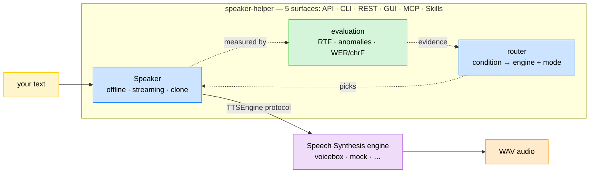

# Speaker Helper

[🇫🇷](https://github.com/warith-harchaoui/speaker-helper/blob/main/LISEZMOI.md) · [🇬🇧](https://github.com/warith-harchaoui/speaker-helper/blob/main/README.md)

[](https://github.com/warith-harchaoui/speaker-helper/actions/workflows/ci.yml) [](LICENSE) [](#)

`Speaker Helper` belongs to a collection of libraries called `AI Helpers` developed for building Artificial Intelligence.

[🌍 AI Helpers](https://harchaoui.org/warith/ai-helpers)

[](https://harchaoui.org/warith/ai-helpers)


**Professional text-to-speech — offline and streaming, with voice cloning and a
built-in evaluation gate — over a local Speech Synthesis engine
([Voicebox](https://github.com/jamiepine/voicebox) by default).**

speaker-helper is the counterpart of
[`vocal-helper`](https://github.com/warith-harchaoui): where vocal-helper turns
*speech into text*, speaker-helper turns **text into speech**. It gives you the
same core over **five surfaces** — a typed Python API, a CLI, a REST API, a
minimal web GUI, an MCP server, and Claude/OpenCode skills — runnable locally
(conda + pip) or as a Docker server.

- **Two modes.** *Offline* (whole text → one audio) and *streaming*
  (sentence-split, low time-to-first-audio).
- **Automatic engine routing.** Tell speaker-helper your *condition* —
  **online real-time** (delay-bounded streaming; speed = real-time factor, must
  run faster than real time) or **offline** (batch; quality is the only
  objective) — and the router picks the best engine + mode from measured
  quality↔speed evidence, with a number-citing justification. No guessing.
- **Real-time on CPU.** The default `kokoro` engine synthesises faster than
  real time (real-time factor well below 1.0) — no GPU required.
- **Backend-agnostic.** The engine is an implementation detail behind a
  `TTSEngine` protocol. Voicebox is the default; a deterministic `mock` backend
  ships for tests and CI, and new backends are a small, local change.
- **Voice cloning, everywhere.** Point at a recording and speaker-helper clones
  the voice — in the library, CLI, REST API, and GUI. Missing transcripts are
  derived automatically with [`vocal-helper`](https://github.com/warith-harchaoui).
- **Built-in AI evaluation.** A committed dataset, versioned thresholds, and
  speed/anomaly/fidelity metrics gate quality in CI — no vibe checks. Quality is
  measured as round-trip **intelligibility** (text→speech→text WER/chrF).
- **Self-hosted, no Hugging Face at runtime.** An optional
  [`speaker-engines`](#self-hosted-engines-no-hugging-face) bundle serves every
  engine + metric model from your own server, so the engines run air-gapped.
- **Batteries included.** Library, CLI (argparse + click), REST API, web GUI,
  MCP server, Claude/OpenCode skills, Docker.

See [`EXAMPLES.md`](https://github.com/warith-harchaoui/speaker-helper/blob/main/EXAMPLES.md) for a runnable cookbook,
[`docs/tech-report.en.md`](https://github.com/warith-harchaoui/speaker-helper/blob/main/docs/tech-report.en.md) for the technical report
([FR](https://github.com/warith-harchaoui/speaker-helper/blob/main/docs/tech-report.fr.md)),
and [`LISEZMOI.md`](https://github.com/warith-harchaoui/speaker-helper/blob/main/LISEZMOI.md) for the French
readme.

## Documentation

[💻 Documentation](https://harchaoui.org/warith/ai-helpers/docs/speaker-helper-doc/)

[🗺️ Landscape](https://github.com/warith-harchaoui/speaker-helper/blob/main/LANDSCAPE.md)

[📋 Examples](https://github.com/warith-harchaoui/speaker-helper/blob/main/EXAMPLES.md)

## How it fits together



speaker-helper talks only to the `TTSEngine` protocol, so the concrete engine
(Voicebox by default) is swappable. The **router** turns an operating condition
into a concrete engine + mode from measured evidence; the **evaluation** layer
produces that evidence. Start an engine once, then point speaker-helper at it.

---

## Installation

**Prerequisites** — **Python 3.10–3.13** and **git**, **libsndfile**, **ffmpeg**, cross-platform. `soundfile` needs the native `libsndfile` library, and `audio-helper` (voice-clone trimming / concatenation) uses `ffmpeg`:

- 🍎 **macOS** ([Homebrew](https://brew.sh)): `brew install python git libsndfile ffmpeg`
- 🐧 **Ubuntu/Debian**: `sudo apt update && sudo apt install -y python3 python3-pip git libsndfile1 ffmpeg`
- 🪟 **Windows** (PowerShell): `winget install Python.Python.3.12 Git.Git ffmpeg` (`libsndfile` is bundled with the `soundfile` wheel — no separate install).

We recommend using Python environments. Check this link if you're unfamiliar with setting one up: [🥸 Tech tips](https://harchaoui.org/warith/4ml/#install).

### From source

speaker-helper is **not on PyPI yet** (PyPI release coming soon). Like the other
`*-helper` projects, it installs from git, pinned to a release tag:

```bash
# core
pip install "git+https://github.com/warith-harchaoui/speaker-helper.git@v0.7.5"
# with extras (server + MCP, and STT for cloning/eval round-trip):
pip install "speaker-helper[server,stt] @ git+https://github.com/warith-harchaoui/speaker-helper.git@v0.7.5"
```

Available extras: `server` (REST API + MCP), `stt` (vocal-helper), `youtube`,
`podcast`, `mic` (speech-to-speech sources), `eval` (DeepEval), `dev`.

Or, for local development (conda + pip):

```bash
conda create -n speaker-helper python=3.11 -y
conda activate speaker-helper
pip install -e ".[server]"          # add ",dev" for the test/lint toolchain
pip install -e ".[server,stt]"      # add ",stt" to auto-transcribe clone references
```

speaker-helper is part of the **AI Helpers** ecosystem: it installs
[`os-helper`](https://github.com/warith-harchaoui/os-helper) (logging) and
[`audio-helper`](https://github.com/warith-harchaoui/audio-helper) (audio
slicing/concatenation) automatically. The optional `stt` extra adds
[`vocal-helper`](https://github.com/warith-harchaoui/vocal-helper) for
transcribing voice-clone references and the evaluation round-trip.

### A Voicebox engine

speaker-helper needs a running Voicebox.

- **Apple Silicon (recommended): native MLX Voicebox on `:17493`.** It uses the
  Apple **GPU** and is markedly faster (well under real time). This is
  speaker-helper's default port, so no override is needed. Note: Docker on macOS
  has **no GPU/Metal passthrough**, so only the native build gets the GPU.
- **CPU / Docker on `:17600`** (portable, no GPU): fine for functionality;
  real-time factor is borderline and load-sensitive on CPU (see
  [`BENCHMARKS.md`](https://github.com/warith-harchaoui/speaker-helper/blob/main/BENCHMARKS.md)).

```bash
git clone https://github.com/jamiepine/voicebox && cd voicebox
docker compose up --build            # serves on 127.0.0.1:17600
```

Then tell speaker-helper where it is (`--port`, `settings.yaml`, or
`SPEAKER_HELPER_VOICEBOX_PORT`).

### Self-hosted engines (no Hugging Face)

By default the engine server downloads model weights from Hugging Face on first
use. For a production or air-gapped box you can instead serve every engine —
**and the evaluation "metrics" models** — from self-hosted archives, so nothing
is fetched from Hugging Face at runtime. The bundle ships as **several small zips**
(one per TTS engine + one for the metric models) so you download only what you
use; each extracts into the same `speaker-engines/` tree:

```bash
cd "$HOME"
for z in tts-hexgrad-kokoro-82m metrics; do                 # add the engines you use
  curl -L "https://harchaoui.org/warith/speaker-engines/speaker-engines-${z}.zip" -o "se-${z}.zip"
  unzip -oq "se-${z}.zip"                                    # -> ~/speaker-engines/…
done
export VOICEBOX_MODELS_DIR="$HOME/speaker-engines/tts"       # Voicebox reads this
export HF_HUB_OFFLINE=1                                      # never phone home
# start the engine as usual — it now loads kokoro/chatterbox/… from the bundle
```

The zips are built once with the scripts in `~/speaker-engines/` (see its
`README.md`); the runtime side needs only the two environment variables above.

---

## Quickstart

### Python

```python
from speaker_helper import Speaker, Settings

spk = Speaker(Settings.from_mapping({
    "engine": "kokoro", "language": "fr", "voicebox": {"port": 17600},
}))
result = spk.save("Bonjour le monde.", "hello.wav")
print(f"{result.duration_s:.2f}s audio, RTF {result.rtf:.2f}")
# 2.80s audio, RTF 0.43
```

### CLI

The primary `speaker-helper` command is a [click](https://click.palletsprojects.com)
group; the standard-library argparse front-end stays available as
`speaker-helper-argparse` (same sub-commands). Global options precede the
sub-command (`speaker-helper --backend mock synth …`).

```bash
speaker-helper --port 17600 voices --engine kokoro
speaker-helper --port 17600 synth "Bonjour le monde." -o hello.wav
speaker-helper --port 17600 synth "Une. Deux. Trois." -o out.wav --stream
speaker-helper route --condition online_realtime --language fr    # pick an engine
speaker-helper --backend mock eval               # gate quality (no engine needed)
speaker-helper --port 17600 --clone synth "Bonjour." -o cloned.wav
```

### REST API server

```bash
speaker-helper --port 17600 serve --host 0.0.0.0 --port 8080
curl -s -X POST localhost:8080/synth -H 'content-type: application/json' \
     -d '{"text": "Bonjour."}' -o out.wav
# streaming (Server-Sent Events, one JSON chunk per sentence):
curl -N -X POST localhost:8080/synth/stream -H 'content-type: application/json' \
     -d '{"text": "Une. Deux. Trois."}'
```

The server also:

- serves a **minimal web GUI** at `/` (a dependency-free vanilla-JS + Tailwind
  page for synth, streaming, voices, cloning, and the router) — just open
  `http://localhost:8080/`;
- exposes `POST /route` (the engine router) alongside `/synth`, `/synth/stream`,
  `/voices`, and `/clone`;
- mounts a **Model Context Protocol** endpoint at `/mcp` (via
  [`fastapi-mcp`](https://github.com/tadata-org/fastapi-mcp), bundled with the
  `server` extra), exposing `synth`, `synth_stream`, `clone_voice`, `list_voices`,
  `route`, and `health` as MCP tools an assistant can call directly.

Or with Docker (server points at a Voicebox on the host):

```bash
docker compose up --build            # speaker-helper API on :8080
```

---

## Choosing an engine (the router)

The evaluation layer *measures* quality and speed; the **router** acts on that
evidence. You state an operating **condition** and it returns a concrete engine
+ mode, justified by the numbers — never a guess.

- **`online_realtime`** — delay-bounded streaming. Speed is the **real-time
  factor (RTF)**: the engine must synthesise *faster than real time* (`RTF < 1`),
  with a margin for time-to-first-audio and jitter (ceiling `0.8`). Among the
  engines that keep up, the router **maximises quality** on the quality↔RTF
  Pareto front, and selects streaming with low-TTFA knobs.
- **`offline`** — batch. There is no real-time constraint, so **quality is the
  only objective**: the highest-quality engine wins, speed disregarded.

Quality is measured as round-trip **intelligibility** (text→speech→text WER/chrF
via `vocal-helper`) or, until an engine is measured, an inherited prior — every
decision reports which (`quality_source`) and a `confidence` flag.

```python
from speaker_helper import route, RouteRequest, Speaker

decision = route(RouteRequest(condition="online_realtime", language="fr"))
print(decision.engine, decision.mode, decision.confidence)
print(decision.justification)

# or build a Speaker straight from a routed operating point:
spk = Speaker.from_route("offline", language="fr")
```

```bash
speaker-helper route --condition online_realtime --language fr
speaker-helper route --condition offline --json decision.json
```

New engines are characterised in the companion *study* (measured RTF / MOS /
speaker-similarity) and folded back here as data — the toolbox routes, the study
measures.

---

## Voice cloning

Point at a recording and speaker-helper clones the voice — in the library, CLI,
and REST API. If you do not supply a transcript of the reference, it is derived
automatically with [`vocal-helper`](https://github.com/warith-harchaoui) (install
the `stt` extra). A ready-to-use reference (`assets/ref-malo.wav`) ships as the
default.

```python
from speaker_helper import Speaker, Settings, VoiceSample

spk = Speaker(Settings.from_mapping({"engine": "chatterbox", "voicebox": {"port": 17600}}))
# give only the audio — the transcript is transcribed and aligned for you:
await spk.clone_voice("malo", [VoiceSample("my_voice.wav", "")])
result = await spk.say("Maintenant je parle avec la voix clonée.")
```

```bash
speaker-helper --port 17600 clone                       # clone the bundled ref-malo, print id
speaker-helper --port 17600 --clone-audio my_voice.wav synth "Bonjour." -o out.wav
```

Reference audio longer than the engine's limit (Voicebox: 30 s) is trimmed
automatically (via [`audio-helper`](https://github.com/warith-harchaoui)) and
re-transcribed so audio and text stay aligned.

---

## Speech-to-speech (re-voicing)

Bring audio in from the AI Helpers source packages and re-voice it — transcribed
with [`vocal-helper`](https://github.com/warith-harchaoui) and spoken back
(optionally in a cloned voice or another language):

```python
import asyncio
from speaker_helper import Speaker, Settings
from speaker_helper.sources import from_youtube, revoice

async def main() -> None:
    src = from_youtube("https://youtu.be/…")                 # extra: youtube
    async with Speaker(Settings.from_mapping({"voicebox": {"port": 17600}})) as spk:
        out = await revoice(src, spk)                        # transcribe + re-speak
    open("revoiced.wav", "wb").write(out.wav_bytes)

asyncio.run(main())
```

```bash
speaker-helper --port 17600 speak-from --source youtube --url https://youtu.be/… -o out.wav
speaker-helper --port 17600 speak-from --source podcast --url https://feed/rss   -o out.wav
speaker-helper --port 17600 --clone speak-from --source mic --seconds 5          -o out.wav
```

Sources are optional extras: `youtube` (`youtube-helper`), `podcast`
(`podcast-helper`), `mic` (`capture-helper`).

---

## Evaluation (no vibe checks)

Quality is gated, not guessed. `speaker-helper eval` runs the engine over a
committed dataset and checks versioned thresholds — **synthesis faster than real
time**, **zero audio anomalies** (empty / clipped / aberrant duration), and,
with an STT transcriber wired in, a WER/chrF **round-trip**. It exits non-zero
when the bar is missed, so it gates CI.

```bash
speaker-helper --backend mock eval                 # deterministic, no engine
speaker-helper --port 17600 --engine kokoro eval --json report.json
# backend=voicebox engine=kokoro cases=12
# mean_rtf=0.3534 p95_rtf=0.3989 anomaly_rate=0.0 quality=0.75 (prior)
# PASS
```

The evaluation targets the engine-agnostic `Speaker`, so the same gate grades
the `mock` backend in CI or a real engine locally — only `--backend` differs.

For teams standardising on a framework, the `eval` extra adds a
[DeepEval](https://github.com/confident-ai/deepeval) binding
(`RealTimeFactorMetric`, `AudioIntegrityMetric`, and `RoundTripIdempotenceMetric`
— the text→speech→text chrF check) that reports the same measurements as DeepEval
custom metrics — deterministic and offline.

---

## Configuration

Copy [`settings.yaml.example`](https://github.com/warith-harchaoui/speaker-helper/blob/main/settings.yaml.example) to `settings.yaml` (it is
gitignored) or use [`speaker_config.json.example`](https://github.com/warith-harchaoui/speaker-helper/blob/main/speaker_config.json.example)
as a reference. Every key can be overridden by a `SPEAKER_HELPER_*` environment
variable; `${VAR}` references inside the YAML are expanded from the environment.

---

## Claude / OpenCode skills

The `skills/` directory holds portable [Claude / OpenCode
skills](https://docs.claude.com/en/docs/agents-and-tools/agent-skills) so an
assistant can drive speaker-helper directly:

- `speaker-helper-synthesize` — text → speech (offline + streaming), voices;
- `speaker-helper-clone-voice` — clone a voice from a reference recording;
- `speaker-helper-choose-engine` — the router (pick an engine by condition and
  quality↔speed).

Copy a skill folder into `~/.claude/skills/` (or your project's `.claude/skills/`,
or OpenCode's skills directory) — no changes needed; the format is shared.

---

## Development

```bash
pip install -e ".[dev,server]"
pytest -q -m "not slow"       # fast, deterministic suite (no engine needed)
pytest -q --cov=speaker_helper --cov-report=term-missing   # with coverage
pytest -q                     # also runs @slow live tests (needs Voicebox)
ruff check speaker_helper tests && ruff format --check speaker_helper tests
speaker-helper --backend mock eval    # run the evaluation gate locally
```

CI runs ruff (lint + format) and the coverage-gated fast suite (`--cov-fail-under=70`)
on Python 3.10–3.13; a failing check blocks merges. The fast suite drives the
deterministic `mock` backend, so it needs no engine.

---

## Author

- [Warith HARCHAOUI](https://linkedin.com/in/warith-harchaoui)

## Acknowledgements

Special thanks to the contributors, reviewers, and users who helped improve
this project — and to the [Voicebox](https://github.com/jamiepine/voicebox)
authors for the engine speaker-helper builds on.

## License

BSD-3-Clause © Warith HARCHAOUI.
