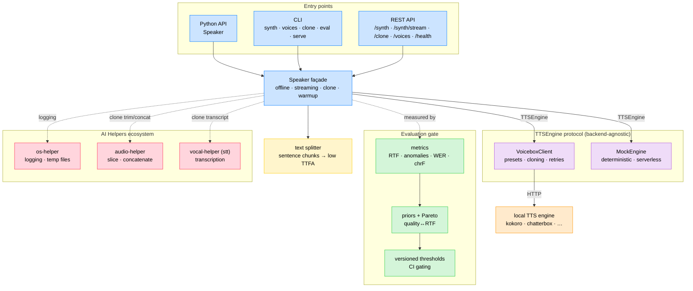
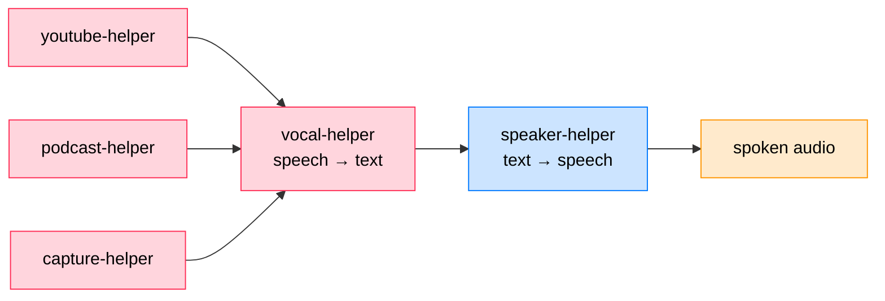

# Technical Stack — speaker-helper

How speaker-helper is put together, what each layer does, and where it sits in
the **AI Helpers** ecosystem.

---

## Architecture

---

## Layers

| Layer | Module | Responsibility |
|------|--------|----------------|
| Types | `types.py` | `Voice`, `AudioResult` (+`rtf`), `StreamChunk`, `VoiceList`, `VoiceSample` |
| Config | `config.py` | YAML + `${VAR}` + `SPEAKER_HELPER_*` overrides; `backend`, `clone`, `mock` |
| Engine | `engine.py` | `TTSEngine` protocol, backend registry, `MockEngine` |
| Backend | `client.py` | `VoiceboxClient` — presets, cloning, retries/backoff, async fallback |
| Façade | `speaker.py` | `Speaker` — `say` / `stream` / `clone_voice` / `warmup` |
| Text | `text.py` | sentence splitting for low time-to-first-audio |
| CLI | `cli.py` | `synth`, `voices`, `clone`, `eval`, `serve` |
| API | `api.py` | FastAPI — offline, SSE streaming, cloning upload |
| Cloning | `cloning.py` | clone defaults (ref-malo), trim + transcript preparation |
| Transcription | `transcription.py` | `vocal-helper` adapter (clone transcript + eval round-trip) |
| Sources | `sources.py` | speech-to-speech in: youtube / podcast / microphone → `revoice` |
| Evaluation | `eval/` | dataset, metrics, priors/Pareto, thresholds, runner, DeepEval metrics |

---

## Design choices

- **Backend-agnostic core.** Everything talks to the `TTSEngine` protocol, never
  to a concrete engine. Voicebox is the default backend; a `mock` backend makes
  the whole package (including the evaluation gate) runnable in CI without a
  server; new backends register with one call.
- **Low time-to-first-audio.** Streaming splits text into sentence chunks and
  pipelines synthesis (`stream_concurrency=1` by default) so the first chunk is
  emitted as early as possible while later chunks are produced ahead of playback.
- **Evaluation, not vibe checks.** A committed dataset + versioned thresholds
  gate speed (RTF), signal integrity (anomalies), and — with a transcriber —
  fidelity (WER/chrF). The gate returns a non-zero exit code for CI.
- **Cloning made trivial.** Supply a recording; the transcript is derived with
  `vocal-helper` and over-long audio is trimmed with `audio-helper`, so a custom
  voice works from the library, CLI, and REST API alike.
- **Ecosystem-native.** Logging goes through `os-helper`; audio slicing and
  concatenation through `audio-helper` — the same building blocks as the other
  `*-helper` projects.

---

## Ecosystem

speaker-helper is the **text → speech** node of the AI Helpers graph, the
inverse of `vocal-helper` (speech → text). Since v0.4.0 it also closes the
**speech-to-speech** loop: `speaker_helper.sources` pulls audio from
`youtube-helper`, `podcast-helper`, or `capture-helper` (live microphone),
transcribes it with `vocal-helper`, and re-voices it.

---

Author: Warith HARCHAOUI — https://harchaoui.org/warith/ai-helpers
